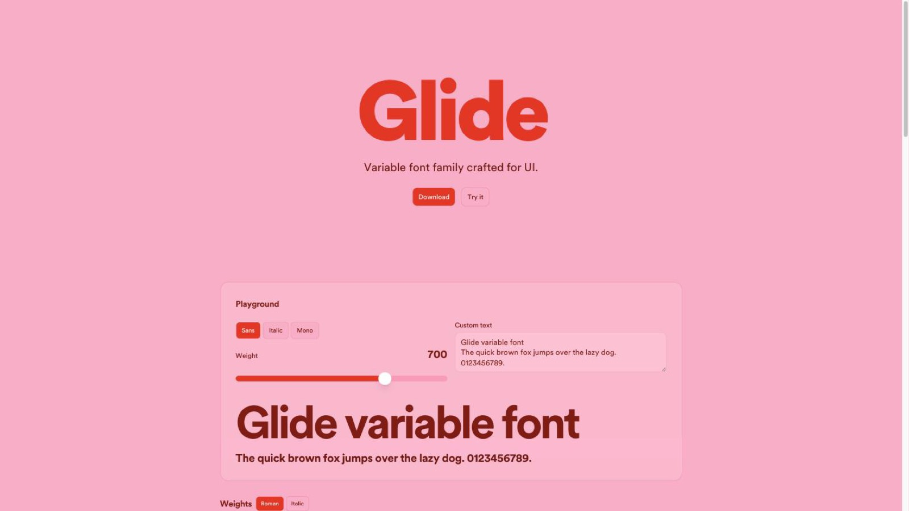

<div align="center">

# [Glide](https://blode.co/glide)

**Glide 4.0 is a variable UI sans-serif with continuous weight and optical-size axes in roman and italic, paired with Glide Mono**

Ship every weight from Thin to Extra Black out of one small font file, with a mono companion for code.

Version 4.0 adds reviewed Text drawings and spacing for compact 12–16px UI,
while preserving the established UI and display designs at larger optical
sizes.

</div>

<p align="center">
  
</p>

## Demo

See the whole family set as running text and specimens.

<p>
<a href="https://blode.co/glide">

</a>
</p>

## Install

For the web, put the WOFF2 files in `app/fonts/` next to your root layout:

```bash
curl -O https://blode.co/glide/4.0.8/glide-variable.woff2
curl -O https://blode.co/glide/4.0.8/glide-variable-italic.woff2
curl -O https://blode.co/glide/glide-mono.woff2
```

For Font Book and design tools, download [glide.zip](https://blode.co/glide/glide.zip): the variable TTFs plus every static instance.

## Quickstart

Configure both fonts in `app/layout.tsx`:

```tsx
import localFont from "next/font/local";
import "./globals.css";

const glide = localFont({
  src: [
    { path: "./fonts/glide-variable.woff2", style: "normal" },
    { path: "./fonts/glide-variable-italic.woff2", style: "italic" },
  ],
  variable: "--font-glide",
  weight: "100 950",
  display: "swap",
});

const glideMono = localFont({
  src: "./fonts/glide-mono.woff2",
  variable: "--font-glide-mono",
  weight: "400",
  display: "swap",
});

export default function RootLayout({
  children,
}: {
  children: React.ReactNode;
}) {
  return (
    <html lang="en" className={`${glide.variable} ${glideMono.variable}`}>
      <body>{children}</body>
    </html>
  );
}
```

Map the variables onto Tailwind's own in your global CSS:

```css
@theme inline {
  --font-sans: var(--font-glide);
  --font-mono: var(--font-glide-mono);
}

html {
  font-optical-sizing: auto;
  font-kerning: normal;
}
```

`font-sans` is now Glide, `font-mono` is Glide Mono, and `italic` picks up the real italic rather than a slanted roman.

## Font weights

Every standard weight is a named instance, so the full ladder shows up in font menus like Font Book. Values in between work too, because the axis is continuous.

| Weight | Name | Class |
| ------ | ---- | ----- |
| 100 | Thin | `font-thin` |
| 200 | ExtraLight | `font-extralight` |
| 300 | Light | `font-light` |
| 400 | Regular | `font-normal` |
| 500 | Medium | `font-medium` |
| 600 | Semibold | `font-semibold` |
| 700 | Bold | `font-bold` |
| 800 | Extrabold | `font-extrabold` |
| 900 | Black | `font-black` |
| 950 | Extra Black | `font-[950]` |

## Notes

- **Two variable files:** roman and italic ship separately with `wght` 100–950 and `opsz` 12–28. Browsers select optical size automatically; `opsz=16` is the unchanged 3.002 design.
- **Glide Mono:** a single-weight 400 companion. Ligatures stay off by default so `-->` and `==` keep their cell width.
- **Size:** leave `font-optical-sizing: auto` enabled for UI. `.glide-display` is an optional tracking refinement, not a legibility requirement.
- **Features:** ligatures on for Sans (`fi`/`fl` and `->`/`=>`). Tabular figures and slashed zero are opt-in (`.glide-tnum`, `.glide-zero`). Mono keeps `tnum` and `zero` on, ligatures off.
- **Formats:** variable TTF and WOFF2, with static instances in the desktop bundle.
- **Blode UI:** Glide is the default family there, applied through `font-sans` and `font-mono`.

## License

[SIL Open Font License 1.1](OFL.txt). Use Glide in personal and commercial work, embed it, modify it. You can't sell the font files on their own, and modified versions can't use the Glide name. Copyright 2026 Matthew Blode.

---

Crafted by [](https://blode.co) [Matthew Blode](https://blode.co)
